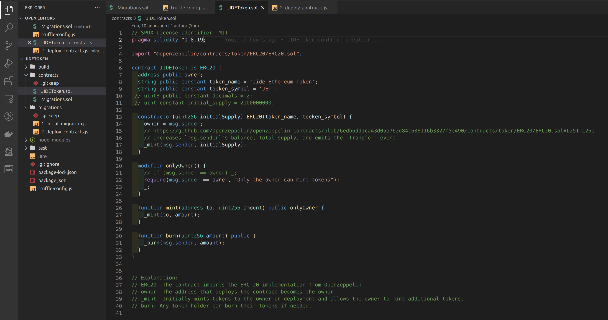
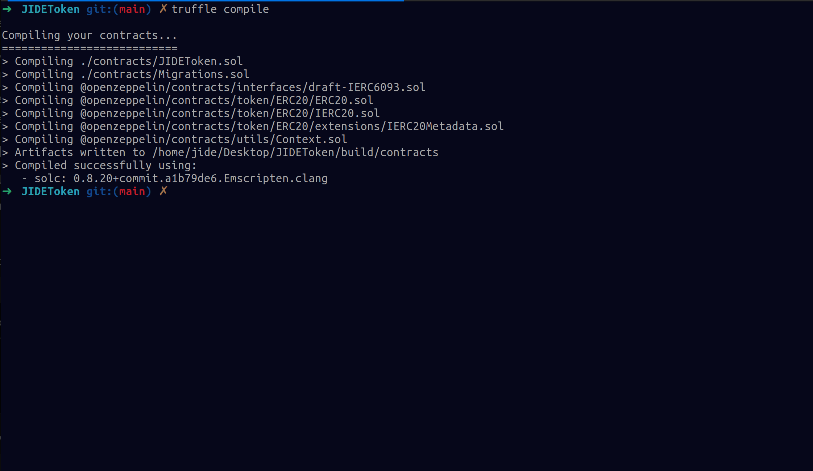
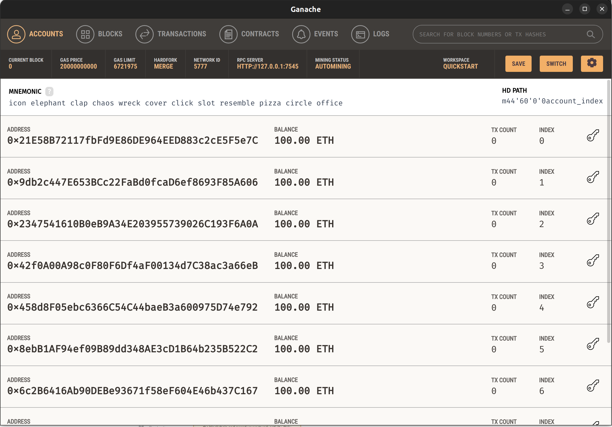
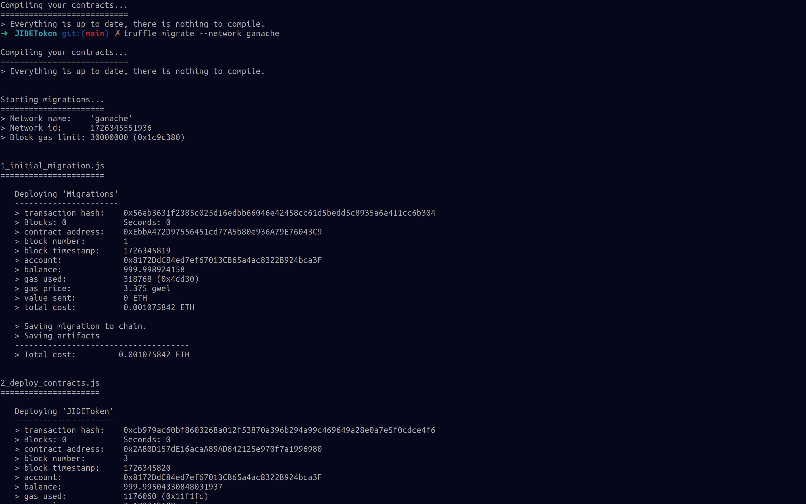
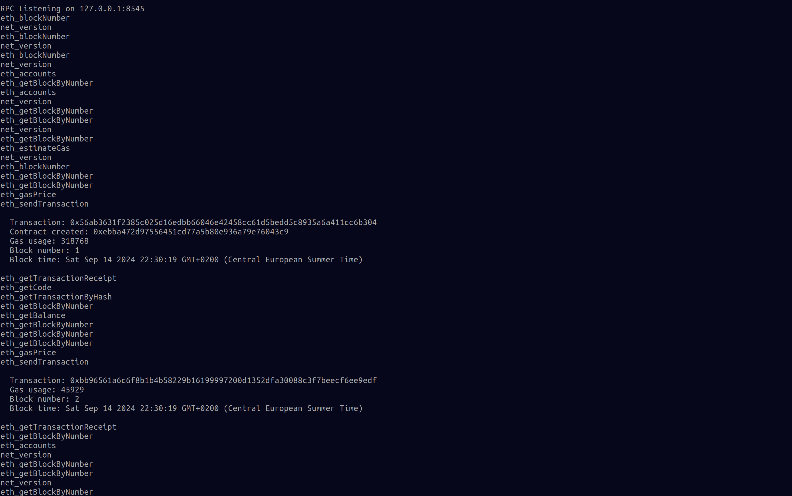
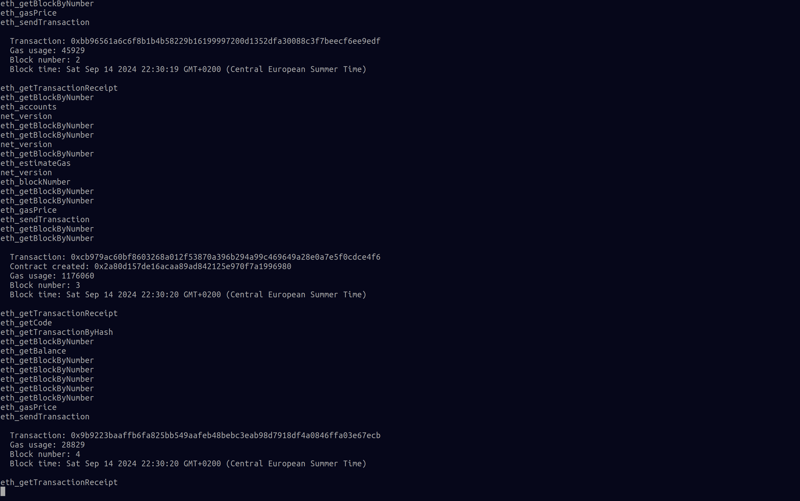
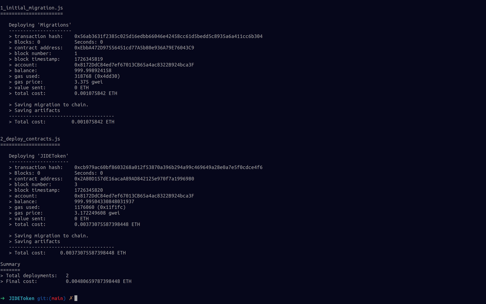

# JIDEToken Creation
## Create and Initialize a Truffle project directory

```bash
mkdir JIDEToken
$ cd JIDEToken
JIDEToken $ truffle init
JIDEToken $ npm init
```
  ### you should have the following directory structure
   JIDEToken/
   + ------ contracts\
   |    -------- Migrations.sol
   + ------ migrations\
   |    -------- 1_initial_migration.js
   + ------ package.json
   + ------ test
   + ------ truffle-config.js

## edit the *truffle-config.js* configuration file to setup your truffle environment
 Here, you can configure your testnet, network, compiler version, docker, test suite and other settings. you should also include a .env file in the root directory containing your test private key for testing and deployment on public ethereum test networks such as Sepolia or Linea Goerli test network.\

 *🚨 warning 🚨*
 - don't forget to gitignore your .env file
 - only use test keys test mnemonics that are not used to hold funds on the main ethereum network

### Install your dependencies

```bash
npm install @openzeppelin/contracts
```
The OpenZeppelin library includes a lot more than the ERC20 token, but we will only use a small part of it.

### Write Token Contract
  create a new .sol file inside contracts folder. Name this file JIDEToken, as it matches the token's name.

  [JIDEToken contract](./contracts/JIDEToken.sol)
  


  Our contract is very simple, as it inherits all its functionality from the OpenZeppelin library.
  In this very file, we define the variables name of the Token, its symbol, and decimals.

### Compile Contract
We now use truffle to compile the JIDEToken code

*⚠️ observation ⚠️*
- Ensure that the compiler version in the truffle-config file is slightly higher than the version specified in the contract files and matches the one in the OpenZeppelin library.

```bash
truffle compile
```



### Setup Migration Scripts
set up a migration script to deploy the JIDEToken contract to the blockchain by creating a new file called "2_deploy_contracts.js", in the JIDEToken/migrations folder.
[Migration Script for JIDEToken contract](./migrations/2_deploy_contracts.js)

### Compile Contract
Before we deploy on one of the Ethereum test networks, let’s start a local
blockchain to test everything. Start the ganache blockchain, either from the command line with ganache-cli or from the graphical user interface.

there are 2 ways to use and install ganache
1. ganache cli 
```bash
npm install -g ganache
ganache  
```
2. [use the AppImage user interface](https://medium.com/yavar/what-is-truffle-install-ganache-on-ubuntu-connect-ganache-in-metamask-a8cd8ed49797)

### Ganache UI



*⚠️ observation ⚠️*
1. The network configuration in [Config File](./truffle-config.js)  includes settings for both the Ganache CLI and User Interface. The only major differences between them are the network ID and port number. For more details, refer to the [documentation](https://archive.trufflesuite.com/docs/ganache/).



On the ganache console, we should see that our deployment has created four
new transactions showing contract creation and contract call,





